# Cognera Figure Library

Status: Epic A implementation

Total figure definitions: 353

Each figure below is deterministic, serializable, and rendered as SVG.

## Basic Primitive

Count: 54

### fig-001 - Primitive circle r0 s0.80

Parameters:

- color: #111827
- rotation: 0
- scale: 0.8
- shape: circle

### fig-002 - Primitive circle r0 s1.00

Parameters:

- color: #1D4ED8
- rotation: 0
- scale: 1.0
- shape: circle

### fig-003 - Primitive circle r90 s0.80

Parameters:

- color: #DC2626
- rotation: 90
- scale: 0.8
- shape: circle

### fig-004 - Primitive circle r90 s1.00

Parameters:

- color: #059669
- rotation: 90
- scale: 1.0
- shape: circle

### fig-005 - Primitive circle r180 s0.80

Parameters:

- color: #7C3AED
- rotation: 180
- scale: 0.8
- shape: circle

### fig-006 - Primitive circle r180 s1.00

Parameters:

- color: #EA580C
- rotation: 180
- scale: 1.0
- shape: circle

### fig-007 - Primitive square r0 s0.80

Parameters:

- color: #0F766E
- rotation: 0
- scale: 0.8
- shape: square

### fig-008 - Primitive square r0 s1.00

Parameters:

- color: #BE123C
- rotation: 0
- scale: 1.0
- shape: square

### fig-009 - Primitive square r90 s0.80

Parameters:

- color: #111827
- rotation: 90
- scale: 0.8
- shape: square

### fig-010 - Primitive square r90 s1.00

Parameters:

- color: #1D4ED8
- rotation: 90
- scale: 1.0
- shape: square

### fig-011 - Primitive square r180 s0.80

Parameters:

- color: #DC2626
- rotation: 180
- scale: 0.8
- shape: square

### fig-012 - Primitive square r180 s1.00

Parameters:

- color: #059669
- rotation: 180
- scale: 1.0
- shape: square

### fig-013 - Primitive triangle r0 s0.80

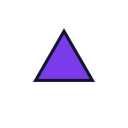

Parameters:

- color: #7C3AED
- rotation: 0
- scale: 0.8
- shape: triangle

### fig-014 - Primitive triangle r0 s1.00

Parameters:

- color: #EA580C
- rotation: 0
- scale: 1.0
- shape: triangle

### fig-015 - Primitive triangle r90 s0.80

Parameters:

- color: #0F766E
- rotation: 90
- scale: 0.8
- shape: triangle

### fig-016 - Primitive triangle r90 s1.00

Parameters:

- color: #BE123C
- rotation: 90
- scale: 1.0
- shape: triangle

### fig-017 - Primitive triangle r180 s0.80

Parameters:

- color: #111827
- rotation: 180
- scale: 0.8
- shape: triangle

### fig-018 - Primitive triangle r180 s1.00

Parameters:

- color: #1D4ED8
- rotation: 180
- scale: 1.0
- shape: triangle

### fig-019 - Primitive diamond r0 s0.80

Parameters:

- color: #DC2626
- rotation: 0
- scale: 0.8
- shape: diamond

### fig-020 - Primitive diamond r0 s1.00

Parameters:

- color: #059669
- rotation: 0
- scale: 1.0
- shape: diamond

### fig-021 - Primitive diamond r90 s0.80

Parameters:

- color: #7C3AED
- rotation: 90
- scale: 0.8
- shape: diamond

### fig-022 - Primitive diamond r90 s1.00

Parameters:

- color: #EA580C
- rotation: 90
- scale: 1.0
- shape: diamond

### fig-023 - Primitive diamond r180 s0.80

Parameters:

- color: #0F766E
- rotation: 180
- scale: 0.8
- shape: diamond

### fig-024 - Primitive diamond r180 s1.00

Parameters:

- color: #BE123C
- rotation: 180
- scale: 1.0
- shape: diamond

### fig-025 - Primitive pentagon r0 s0.80

Parameters:

- color: #111827
- rotation: 0
- scale: 0.8
- shape: pentagon

### fig-026 - Primitive pentagon r0 s1.00

Parameters:

- color: #1D4ED8
- rotation: 0
- scale: 1.0
- shape: pentagon

### fig-027 - Primitive pentagon r90 s0.80

Parameters:

- color: #DC2626
- rotation: 90
- scale: 0.8
- shape: pentagon

### fig-028 - Primitive pentagon r90 s1.00

Parameters:

- color: #059669
- rotation: 90
- scale: 1.0
- shape: pentagon

### fig-029 - Primitive pentagon r180 s0.80

Parameters:

- color: #7C3AED
- rotation: 180
- scale: 0.8
- shape: pentagon

### fig-030 - Primitive pentagon r180 s1.00

Parameters:

- color: #EA580C
- rotation: 180
- scale: 1.0
- shape: pentagon

### fig-031 - Primitive hexagon r0 s0.80

Parameters:

- color: #0F766E
- rotation: 0
- scale: 0.8
- shape: hexagon

### fig-032 - Primitive hexagon r0 s1.00

Parameters:

- color: #BE123C
- rotation: 0
- scale: 1.0
- shape: hexagon

### fig-033 - Primitive hexagon r90 s0.80

Parameters:

- color: #111827
- rotation: 90
- scale: 0.8
- shape: hexagon

### fig-034 - Primitive hexagon r90 s1.00

Parameters:

- color: #1D4ED8
- rotation: 90
- scale: 1.0
- shape: hexagon

### fig-035 - Primitive hexagon r180 s0.80

Parameters:

- color: #DC2626
- rotation: 180
- scale: 0.8
- shape: hexagon

### fig-036 - Primitive hexagon r180 s1.00

Parameters:

- color: #059669
- rotation: 180
- scale: 1.0
- shape: hexagon

### fig-037 - Primitive octagon r0 s0.80

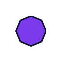

Parameters:

- color: #7C3AED
- rotation: 0
- scale: 0.8
- shape: octagon

### fig-038 - Primitive octagon r0 s1.00

Parameters:

- color: #EA580C
- rotation: 0
- scale: 1.0
- shape: octagon

### fig-039 - Primitive octagon r90 s0.80

Parameters:

- color: #0F766E
- rotation: 90
- scale: 0.8
- shape: octagon

### fig-040 - Primitive octagon r90 s1.00

Parameters:

- color: #BE123C
- rotation: 90
- scale: 1.0
- shape: octagon

### fig-041 - Primitive octagon r180 s0.80

Parameters:

- color: #111827
- rotation: 180
- scale: 0.8
- shape: octagon

### fig-042 - Primitive octagon r180 s1.00

Parameters:

- color: #1D4ED8
- rotation: 180
- scale: 1.0
- shape: octagon

### fig-043 - Primitive line r0 s0.80

Parameters:

- color: #DC2626
- rotation: 0
- scale: 0.8
- shape: line

### fig-044 - Primitive line r0 s1.00

Parameters:

- color: #059669
- rotation: 0
- scale: 1.0
- shape: line

### fig-045 - Primitive line r90 s0.80

Parameters:

- color: #7C3AED
- rotation: 90
- scale: 0.8
- shape: line

### fig-046 - Primitive line r90 s1.00

Parameters:

- color: #EA580C
- rotation: 90
- scale: 1.0
- shape: line

### fig-047 - Primitive line r180 s0.80

Parameters:

- color: #0F766E
- rotation: 180
- scale: 0.8
- shape: line

### fig-048 - Primitive line r180 s1.00

Parameters:

- color: #BE123C
- rotation: 180
- scale: 1.0
- shape: line

### fig-049 - Primitive arc r0 s0.80

Parameters:

- color: #111827
- rotation: 0
- scale: 0.8
- shape: arc

### fig-050 - Primitive arc r0 s1.00

Parameters:

- color: #1D4ED8
- rotation: 0
- scale: 1.0
- shape: arc

### fig-051 - Primitive arc r90 s0.80

Parameters:

- color: #DC2626
- rotation: 90
- scale: 0.8
- shape: arc

### fig-052 - Primitive arc r90 s1.00

Parameters:

- color: #059669
- rotation: 90
- scale: 1.0
- shape: arc

### fig-053 - Primitive arc r180 s0.80

Parameters:

- color: #7C3AED
- rotation: 180
- scale: 0.8
- shape: arc

### fig-054 - Primitive arc r180 s1.00

Parameters:

- color: #EA580C
- rotation: 180
- scale: 1.0
- shape: arc

## Composite Figure

Count: 32

### fig-055 - Composite circle-triangle r0

Parameters:

- base: circle
- base_color: #0F766E
- overlay: triangle
- overlay_color: #1D4ED8
- rotation: 0

### fig-056 - Composite circle-triangle r90

Parameters:

- base: circle
- base_color: #BE123C
- overlay: triangle
- overlay_color: #DC2626
- rotation: 90

### fig-057 - Composite circle-triangle r180

Parameters:

- base: circle
- base_color: #111827
- overlay: triangle
- overlay_color: #059669
- rotation: 180

### fig-058 - Composite circle-triangle r270

Parameters:

- base: circle
- base_color: #1D4ED8
- overlay: triangle
- overlay_color: #7C3AED
- rotation: 270

### fig-059 - Composite square-circle r0

Parameters:

- base: square
- base_color: #DC2626
- overlay: circle
- overlay_color: #EA580C
- rotation: 0

### fig-060 - Composite square-circle r90

Parameters:

- base: square
- base_color: #059669
- overlay: circle
- overlay_color: #0F766E
- rotation: 90

### fig-061 - Composite square-circle r180

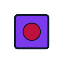

Parameters:

- base: square
- base_color: #7C3AED
- overlay: circle
- overlay_color: #BE123C
- rotation: 180

### fig-062 - Composite square-circle r270

Parameters:

- base: square
- base_color: #EA580C
- overlay: circle
- overlay_color: #111827
- rotation: 270

### fig-063 - Composite diamond-square r0

Parameters:

- base: diamond
- base_color: #0F766E
- overlay: square
- overlay_color: #1D4ED8
- rotation: 0

### fig-064 - Composite diamond-square r90

Parameters:

- base: diamond
- base_color: #BE123C
- overlay: square
- overlay_color: #DC2626
- rotation: 90

### fig-065 - Composite diamond-square r180

Parameters:

- base: diamond
- base_color: #111827
- overlay: square
- overlay_color: #059669
- rotation: 180

### fig-066 - Composite diamond-square r270

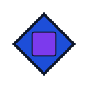

Parameters:

- base: diamond
- base_color: #1D4ED8
- overlay: square
- overlay_color: #7C3AED
- rotation: 270

### fig-067 - Composite hexagon-triangle r0

Parameters:

- base: hexagon
- base_color: #DC2626
- overlay: triangle
- overlay_color: #EA580C
- rotation: 0

### fig-068 - Composite hexagon-triangle r90

Parameters:

- base: hexagon
- base_color: #059669
- overlay: triangle
- overlay_color: #0F766E
- rotation: 90

### fig-069 - Composite hexagon-triangle r180

Parameters:

- base: hexagon
- base_color: #7C3AED
- overlay: triangle
- overlay_color: #BE123C
- rotation: 180

### fig-070 - Composite hexagon-triangle r270

Parameters:

- base: hexagon
- base_color: #EA580C
- overlay: triangle
- overlay_color: #111827
- rotation: 270

### fig-071 - Composite octagon-circle r0

Parameters:

- base: octagon
- base_color: #0F766E
- overlay: circle
- overlay_color: #1D4ED8
- rotation: 0

### fig-072 - Composite octagon-circle r90

Parameters:

- base: octagon
- base_color: #BE123C
- overlay: circle
- overlay_color: #DC2626
- rotation: 90

### fig-073 - Composite octagon-circle r180

Parameters:

- base: octagon
- base_color: #111827
- overlay: circle
- overlay_color: #059669
- rotation: 180

### fig-074 - Composite octagon-circle r270

Parameters:

- base: octagon
- base_color: #1D4ED8
- overlay: circle
- overlay_color: #7C3AED
- rotation: 270

### fig-075 - Composite pentagon-diamond r0

Parameters:

- base: pentagon
- base_color: #DC2626
- overlay: diamond
- overlay_color: #EA580C
- rotation: 0

### fig-076 - Composite pentagon-diamond r90

Parameters:

- base: pentagon
- base_color: #059669
- overlay: diamond
- overlay_color: #0F766E
- rotation: 90

### fig-077 - Composite pentagon-diamond r180

Parameters:

- base: pentagon
- base_color: #7C3AED
- overlay: diamond
- overlay_color: #BE123C
- rotation: 180

### fig-078 - Composite pentagon-diamond r270

Parameters:

- base: pentagon
- base_color: #EA580C
- overlay: diamond
- overlay_color: #111827
- rotation: 270

### fig-079 - Composite triangle-line r0

Parameters:

- base: triangle
- base_color: #0F766E
- overlay: line
- overlay_color: #1D4ED8
- rotation: 0

### fig-080 - Composite triangle-line r90

Parameters:

- base: triangle
- base_color: #BE123C
- overlay: line
- overlay_color: #DC2626
- rotation: 90

### fig-081 - Composite triangle-line r180

Parameters:

- base: triangle
- base_color: #111827
- overlay: line
- overlay_color: #059669
- rotation: 180

### fig-082 - Composite triangle-line r270

Parameters:

- base: triangle
- base_color: #1D4ED8
- overlay: line
- overlay_color: #7C3AED
- rotation: 270

### fig-083 - Composite circle-arc r0

Parameters:

- base: circle
- base_color: #DC2626
- overlay: arc
- overlay_color: #EA580C
- rotation: 0

### fig-084 - Composite circle-arc r90

Parameters:

- base: circle
- base_color: #059669
- overlay: arc
- overlay_color: #0F766E
- rotation: 90

### fig-085 - Composite circle-arc r180

Parameters:

- base: circle
- base_color: #7C3AED
- overlay: arc
- overlay_color: #BE123C
- rotation: 180

### fig-086 - Composite circle-arc r270

Parameters:

- base: circle
- base_color: #EA580C
- overlay: arc
- overlay_color: #111827
- rotation: 270

## Nested Figure

Count: 45

### fig-087 - Nested circle-circle v1

Parameters:

- inner: circle
- inner_color: #DC2626
- outer: circle
- outer_color: #BE123C
- ring_stroke: 2
- variant: 0

### fig-088 - Nested circle-circle v2

Parameters:

- inner: circle
- inner_color: #7C3AED
- outer: circle
- outer_color: #1D4ED8
- ring_stroke: 2
- variant: 1

### fig-089 - Nested circle-circle v3

Parameters:

- inner: circle
- inner_color: #0F766E
- outer: circle
- outer_color: #059669
- ring_stroke: 2
- variant: 2

### fig-090 - Nested circle-circle v1

Parameters:

- inner: circle
- inner_color: #EA580C
- outer: circle
- outer_color: #DC2626
- ring_stroke: 4
- variant: 0

### fig-091 - Nested circle-circle v2

Parameters:

- inner: circle
- inner_color: #BE123C
- outer: circle
- outer_color: #7C3AED
- ring_stroke: 4
- variant: 1

### fig-092 - Nested circle-circle v3

Parameters:

- inner: circle
- inner_color: #1D4ED8
- outer: circle
- outer_color: #0F766E
- ring_stroke: 4
- variant: 2

### fig-093 - Nested circle-circle v1

Parameters:

- inner: circle
- inner_color: #111827
- outer: circle
- outer_color: #EA580C
- ring_stroke: 6
- variant: 0

### fig-094 - Nested circle-circle v2

Parameters:

- inner: circle
- inner_color: #DC2626
- outer: circle
- outer_color: #BE123C
- ring_stroke: 6
- variant: 1

### fig-095 - Nested circle-circle v3

Parameters:

- inner: circle
- inner_color: #7C3AED
- outer: circle
- outer_color: #1D4ED8
- ring_stroke: 6
- variant: 2

### fig-096 - Nested square-diamond v1

Parameters:

- inner: diamond
- inner_color: #059669
- outer: square
- outer_color: #111827
- ring_stroke: 2
- variant: 0

### fig-097 - Nested square-diamond v2

Parameters:

- inner: diamond
- inner_color: #EA580C
- outer: square
- outer_color: #DC2626
- ring_stroke: 2
- variant: 1

### fig-098 - Nested square-diamond v3

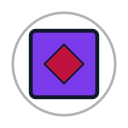

Parameters:

- inner: diamond
- inner_color: #BE123C
- outer: square
- outer_color: #7C3AED
- ring_stroke: 2
- variant: 2

### fig-099 - Nested square-diamond v1

Parameters:

- inner: diamond
- inner_color: #0F766E
- outer: square
- outer_color: #059669
- ring_stroke: 4
- variant: 0

### fig-100 - Nested square-diamond v2

Parameters:

- inner: diamond
- inner_color: #111827
- outer: square
- outer_color: #EA580C
- ring_stroke: 4
- variant: 1

### fig-101 - Nested square-diamond v3

Parameters:

- inner: diamond
- inner_color: #DC2626
- outer: square
- outer_color: #BE123C
- ring_stroke: 4
- variant: 2

### fig-102 - Nested square-diamond v1

Parameters:

- inner: diamond
- inner_color: #1D4ED8
- outer: square
- outer_color: #0F766E
- ring_stroke: 6
- variant: 0

### fig-103 - Nested square-diamond v2

Parameters:

- inner: diamond
- inner_color: #059669
- outer: square
- outer_color: #111827
- ring_stroke: 6
- variant: 1

### fig-104 - Nested square-diamond v3

Parameters:

- inner: diamond
- inner_color: #EA580C
- outer: square
- outer_color: #DC2626
- ring_stroke: 6
- variant: 2

### fig-105 - Nested triangle-circle v1

Parameters:

- inner: circle
- inner_color: #7C3AED
- outer: triangle
- outer_color: #1D4ED8
- ring_stroke: 2
- variant: 0

### fig-106 - Nested triangle-circle v2

Parameters:

- inner: circle
- inner_color: #0F766E
- outer: triangle
- outer_color: #059669
- ring_stroke: 2
- variant: 1

### fig-107 - Nested triangle-circle v3

Parameters:

- inner: circle
- inner_color: #111827
- outer: triangle
- outer_color: #EA580C
- ring_stroke: 2
- variant: 2

### fig-108 - Nested triangle-circle v1

Parameters:

- inner: circle
- inner_color: #BE123C
- outer: triangle
- outer_color: #7C3AED
- ring_stroke: 4
- variant: 0

### fig-109 - Nested triangle-circle v2

Parameters:

- inner: circle
- inner_color: #1D4ED8
- outer: triangle
- outer_color: #0F766E
- ring_stroke: 4
- variant: 1

### fig-110 - Nested triangle-circle v3

Parameters:

- inner: circle
- inner_color: #059669
- outer: triangle
- outer_color: #111827
- ring_stroke: 4
- variant: 2

### fig-111 - Nested triangle-circle v1

Parameters:

- inner: circle
- inner_color: #DC2626
- outer: triangle
- outer_color: #BE123C
- ring_stroke: 6
- variant: 0

### fig-112 - Nested triangle-circle v2

Parameters:

- inner: circle
- inner_color: #7C3AED
- outer: triangle
- outer_color: #1D4ED8
- ring_stroke: 6
- variant: 1

### fig-113 - Nested triangle-circle v3

Parameters:

- inner: circle
- inner_color: #0F766E
- outer: triangle
- outer_color: #059669
- ring_stroke: 6
- variant: 2

### fig-114 - Nested hexagon-triangle v1

Parameters:

- inner: triangle
- inner_color: #EA580C
- outer: hexagon
- outer_color: #DC2626
- ring_stroke: 2
- variant: 0

### fig-115 - Nested hexagon-triangle v2

Parameters:

- inner: triangle
- inner_color: #BE123C
- outer: hexagon
- outer_color: #7C3AED
- ring_stroke: 2
- variant: 1

### fig-116 - Nested hexagon-triangle v3

Parameters:

- inner: triangle
- inner_color: #1D4ED8
- outer: hexagon
- outer_color: #0F766E
- ring_stroke: 2
- variant: 2

### fig-117 - Nested hexagon-triangle v1

Parameters:

- inner: triangle
- inner_color: #111827
- outer: hexagon
- outer_color: #EA580C
- ring_stroke: 4
- variant: 0

### fig-118 - Nested hexagon-triangle v2

Parameters:

- inner: triangle
- inner_color: #DC2626
- outer: hexagon
- outer_color: #BE123C
- ring_stroke: 4
- variant: 1

### fig-119 - Nested hexagon-triangle v3

Parameters:

- inner: triangle
- inner_color: #7C3AED
- outer: hexagon
- outer_color: #1D4ED8
- ring_stroke: 4
- variant: 2

### fig-120 - Nested hexagon-triangle v1

Parameters:

- inner: triangle
- inner_color: #059669
- outer: hexagon
- outer_color: #111827
- ring_stroke: 6
- variant: 0

### fig-121 - Nested hexagon-triangle v2

Parameters:

- inner: triangle
- inner_color: #EA580C
- outer: hexagon
- outer_color: #DC2626
- ring_stroke: 6
- variant: 1

### fig-122 - Nested hexagon-triangle v3

Parameters:

- inner: triangle
- inner_color: #BE123C
- outer: hexagon
- outer_color: #7C3AED
- ring_stroke: 6
- variant: 2

### fig-123 - Nested octagon-square v1

Parameters:

- inner: square
- inner_color: #0F766E
- outer: octagon
- outer_color: #059669
- ring_stroke: 2
- variant: 0

### fig-124 - Nested octagon-square v2

Parameters:

- inner: square
- inner_color: #111827
- outer: octagon
- outer_color: #EA580C
- ring_stroke: 2
- variant: 1

### fig-125 - Nested octagon-square v3

Parameters:

- inner: square
- inner_color: #DC2626
- outer: octagon
- outer_color: #BE123C
- ring_stroke: 2
- variant: 2

### fig-126 - Nested octagon-square v1

Parameters:

- inner: square
- inner_color: #1D4ED8
- outer: octagon
- outer_color: #0F766E
- ring_stroke: 4
- variant: 0

### fig-127 - Nested octagon-square v2

Parameters:

- inner: square
- inner_color: #059669
- outer: octagon
- outer_color: #111827
- ring_stroke: 4
- variant: 1

### fig-128 - Nested octagon-square v3

Parameters:

- inner: square
- inner_color: #EA580C
- outer: octagon
- outer_color: #DC2626
- ring_stroke: 4
- variant: 2

### fig-129 - Nested octagon-square v1

Parameters:

- inner: square
- inner_color: #7C3AED
- outer: octagon
- outer_color: #1D4ED8
- ring_stroke: 6
- variant: 0

### fig-130 - Nested octagon-square v2

Parameters:

- inner: square
- inner_color: #0F766E
- outer: octagon
- outer_color: #059669
- ring_stroke: 6
- variant: 1

### fig-131 - Nested octagon-square v3

Parameters:

- inner: square
- inner_color: #111827
- outer: octagon
- outer_color: #EA580C
- ring_stroke: 6
- variant: 2

## Decorative Element

Count: 72

### fig-132 - Decorative circle dots r0

Parameters:

- base_shape: circle
- color: #059669
- decoration: dots
- rotation: 0

### fig-133 - Decorative circle dots r90

Parameters:

- base_shape: circle
- color: #7C3AED
- decoration: dots
- rotation: 90

### fig-134 - Decorative circle dots r180

Parameters:

- base_shape: circle
- color: #EA580C
- decoration: dots
- rotation: 180

### fig-135 - Decorative circle dots r270

Parameters:

- base_shape: circle
- color: #0F766E
- decoration: dots
- rotation: 270

### fig-136 - Decorative circle crosshair r0

Parameters:

- base_shape: circle
- color: #BE123C
- decoration: crosshair
- rotation: 0

### fig-137 - Decorative circle crosshair r90

Parameters:

- base_shape: circle
- color: #111827
- decoration: crosshair
- rotation: 90

### fig-138 - Decorative circle crosshair r180

Parameters:

- base_shape: circle
- color: #1D4ED8
- decoration: crosshair
- rotation: 180

### fig-139 - Decorative circle crosshair r270

Parameters:

- base_shape: circle
- color: #DC2626
- decoration: crosshair
- rotation: 270

### fig-140 - Decorative circle ring r0

Parameters:

- base_shape: circle
- color: #059669
- decoration: ring
- rotation: 0

### fig-141 - Decorative circle ring r90

Parameters:

- base_shape: circle
- color: #7C3AED
- decoration: ring
- rotation: 90

### fig-142 - Decorative circle ring r180

Parameters:

- base_shape: circle
- color: #EA580C
- decoration: ring
- rotation: 180

### fig-143 - Decorative circle ring r270

Parameters:

- base_shape: circle
- color: #0F766E
- decoration: ring
- rotation: 270

### fig-144 - Decorative square dots r0

Parameters:

- base_shape: square
- color: #BE123C
- decoration: dots
- rotation: 0

### fig-145 - Decorative square dots r90

Parameters:

- base_shape: square
- color: #111827
- decoration: dots
- rotation: 90

### fig-146 - Decorative square dots r180

Parameters:

- base_shape: square
- color: #1D4ED8
- decoration: dots
- rotation: 180

### fig-147 - Decorative square dots r270

Parameters:

- base_shape: square
- color: #DC2626
- decoration: dots
- rotation: 270

### fig-148 - Decorative square crosshair r0

Parameters:

- base_shape: square
- color: #059669
- decoration: crosshair
- rotation: 0

### fig-149 - Decorative square crosshair r90

Parameters:

- base_shape: square
- color: #7C3AED
- decoration: crosshair
- rotation: 90

### fig-150 - Decorative square crosshair r180

Parameters:

- base_shape: square
- color: #EA580C
- decoration: crosshair
- rotation: 180

### fig-151 - Decorative square crosshair r270

Parameters:

- base_shape: square
- color: #0F766E
- decoration: crosshair
- rotation: 270

### fig-152 - Decorative square ring r0

Parameters:

- base_shape: square
- color: #BE123C
- decoration: ring
- rotation: 0

### fig-153 - Decorative square ring r90

Parameters:

- base_shape: square
- color: #111827
- decoration: ring
- rotation: 90

### fig-154 - Decorative square ring r180

Parameters:

- base_shape: square
- color: #1D4ED8
- decoration: ring
- rotation: 180

### fig-155 - Decorative square ring r270

Parameters:

- base_shape: square
- color: #DC2626
- decoration: ring
- rotation: 270

### fig-156 - Decorative triangle dots r0

Parameters:

- base_shape: triangle
- color: #059669
- decoration: dots
- rotation: 0

### fig-157 - Decorative triangle dots r90

Parameters:

- base_shape: triangle
- color: #7C3AED
- decoration: dots
- rotation: 90

### fig-158 - Decorative triangle dots r180

Parameters:

- base_shape: triangle
- color: #EA580C
- decoration: dots
- rotation: 180

### fig-159 - Decorative triangle dots r270

Parameters:

- base_shape: triangle
- color: #0F766E
- decoration: dots
- rotation: 270

### fig-160 - Decorative triangle crosshair r0

Parameters:

- base_shape: triangle
- color: #BE123C
- decoration: crosshair
- rotation: 0

### fig-161 - Decorative triangle crosshair r90

Parameters:

- base_shape: triangle
- color: #111827
- decoration: crosshair
- rotation: 90

### fig-162 - Decorative triangle crosshair r180

Parameters:

- base_shape: triangle
- color: #1D4ED8
- decoration: crosshair
- rotation: 180

### fig-163 - Decorative triangle crosshair r270

Parameters:

- base_shape: triangle
- color: #DC2626
- decoration: crosshair
- rotation: 270

### fig-164 - Decorative triangle ring r0

Parameters:

- base_shape: triangle
- color: #059669
- decoration: ring
- rotation: 0

### fig-165 - Decorative triangle ring r90

Parameters:

- base_shape: triangle
- color: #7C3AED
- decoration: ring
- rotation: 90

### fig-166 - Decorative triangle ring r180

Parameters:

- base_shape: triangle
- color: #EA580C
- decoration: ring
- rotation: 180

### fig-167 - Decorative triangle ring r270

Parameters:

- base_shape: triangle
- color: #0F766E
- decoration: ring
- rotation: 270

### fig-168 - Decorative diamond dots r0

Parameters:

- base_shape: diamond
- color: #BE123C
- decoration: dots
- rotation: 0

### fig-169 - Decorative diamond dots r90

Parameters:

- base_shape: diamond
- color: #111827
- decoration: dots
- rotation: 90

### fig-170 - Decorative diamond dots r180

Parameters:

- base_shape: diamond
- color: #1D4ED8
- decoration: dots
- rotation: 180

### fig-171 - Decorative diamond dots r270

Parameters:

- base_shape: diamond
- color: #DC2626
- decoration: dots
- rotation: 270

### fig-172 - Decorative diamond crosshair r0

Parameters:

- base_shape: diamond
- color: #059669
- decoration: crosshair
- rotation: 0

### fig-173 - Decorative diamond crosshair r90

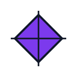

Parameters:

- base_shape: diamond
- color: #7C3AED
- decoration: crosshair
- rotation: 90

### fig-174 - Decorative diamond crosshair r180

Parameters:

- base_shape: diamond
- color: #EA580C
- decoration: crosshair
- rotation: 180

### fig-175 - Decorative diamond crosshair r270

Parameters:

- base_shape: diamond
- color: #0F766E
- decoration: crosshair
- rotation: 270

### fig-176 - Decorative diamond ring r0

Parameters:

- base_shape: diamond
- color: #BE123C
- decoration: ring
- rotation: 0

### fig-177 - Decorative diamond ring r90

Parameters:

- base_shape: diamond
- color: #111827
- decoration: ring
- rotation: 90

### fig-178 - Decorative diamond ring r180

Parameters:

- base_shape: diamond
- color: #1D4ED8
- decoration: ring
- rotation: 180

### fig-179 - Decorative diamond ring r270

Parameters:

- base_shape: diamond
- color: #DC2626
- decoration: ring
- rotation: 270

### fig-180 - Decorative pentagon dots r0

Parameters:

- base_shape: pentagon
- color: #059669
- decoration: dots
- rotation: 0

### fig-181 - Decorative pentagon dots r90

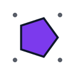

Parameters:

- base_shape: pentagon
- color: #7C3AED
- decoration: dots
- rotation: 90

### fig-182 - Decorative pentagon dots r180

Parameters:

- base_shape: pentagon
- color: #EA580C
- decoration: dots
- rotation: 180

### fig-183 - Decorative pentagon dots r270

Parameters:

- base_shape: pentagon
- color: #0F766E
- decoration: dots
- rotation: 270

### fig-184 - Decorative pentagon crosshair r0

Parameters:

- base_shape: pentagon
- color: #BE123C
- decoration: crosshair
- rotation: 0

### fig-185 - Decorative pentagon crosshair r90

Parameters:

- base_shape: pentagon
- color: #111827
- decoration: crosshair
- rotation: 90

### fig-186 - Decorative pentagon crosshair r180

Parameters:

- base_shape: pentagon
- color: #1D4ED8
- decoration: crosshair
- rotation: 180

### fig-187 - Decorative pentagon crosshair r270

Parameters:

- base_shape: pentagon
- color: #DC2626
- decoration: crosshair
- rotation: 270

### fig-188 - Decorative pentagon ring r0

Parameters:

- base_shape: pentagon
- color: #059669
- decoration: ring
- rotation: 0

### fig-189 - Decorative pentagon ring r90

Parameters:

- base_shape: pentagon
- color: #7C3AED
- decoration: ring
- rotation: 90

### fig-190 - Decorative pentagon ring r180

Parameters:

- base_shape: pentagon
- color: #EA580C
- decoration: ring
- rotation: 180

### fig-191 - Decorative pentagon ring r270

Parameters:

- base_shape: pentagon
- color: #0F766E
- decoration: ring
- rotation: 270

### fig-192 - Decorative hexagon dots r0

Parameters:

- base_shape: hexagon
- color: #BE123C
- decoration: dots
- rotation: 0

### fig-193 - Decorative hexagon dots r90

Parameters:

- base_shape: hexagon
- color: #111827
- decoration: dots
- rotation: 90

### fig-194 - Decorative hexagon dots r180

Parameters:

- base_shape: hexagon
- color: #1D4ED8
- decoration: dots
- rotation: 180

### fig-195 - Decorative hexagon dots r270

Parameters:

- base_shape: hexagon
- color: #DC2626
- decoration: dots
- rotation: 270

### fig-196 - Decorative hexagon crosshair r0

Parameters:

- base_shape: hexagon
- color: #059669
- decoration: crosshair
- rotation: 0

### fig-197 - Decorative hexagon crosshair r90

Parameters:

- base_shape: hexagon
- color: #7C3AED
- decoration: crosshair
- rotation: 90

### fig-198 - Decorative hexagon crosshair r180

Parameters:

- base_shape: hexagon
- color: #EA580C
- decoration: crosshair
- rotation: 180

### fig-199 - Decorative hexagon crosshair r270

Parameters:

- base_shape: hexagon
- color: #0F766E
- decoration: crosshair
- rotation: 270

### fig-200 - Decorative hexagon ring r0

Parameters:

- base_shape: hexagon
- color: #BE123C
- decoration: ring
- rotation: 0

### fig-201 - Decorative hexagon ring r90

Parameters:

- base_shape: hexagon
- color: #111827
- decoration: ring
- rotation: 90

### fig-202 - Decorative hexagon ring r180

Parameters:

- base_shape: hexagon
- color: #1D4ED8
- decoration: ring
- rotation: 180

### fig-203 - Decorative hexagon ring r270

Parameters:

- base_shape: hexagon
- color: #DC2626
- decoration: ring
- rotation: 270

## Connector

Count: 60

### fig-204 - Connector bridge circle v1

Parameters:

- color: #7C3AED
- connector_kind: bridge
- node_shape: circle
- variant: 0

### fig-205 - Connector bridge circle v2

Parameters:

- color: #0F766E
- connector_kind: bridge
- node_shape: circle
- variant: 1

### fig-206 - Connector bridge circle v3

Parameters:

- color: #111827
- connector_kind: bridge
- node_shape: circle
- variant: 2

### fig-207 - Connector bridge circle v4

Parameters:

- color: #DC2626
- connector_kind: bridge
- node_shape: circle
- variant: 3

### fig-208 - Connector bridge square v1

Parameters:

- color: #111827
- connector_kind: bridge
- node_shape: square
- variant: 0

### fig-209 - Connector bridge square v2

Parameters:

- color: #DC2626
- connector_kind: bridge
- node_shape: square
- variant: 1

### fig-210 - Connector bridge square v3

Parameters:

- color: #7C3AED
- connector_kind: bridge
- node_shape: square
- variant: 2

### fig-211 - Connector bridge square v4

Parameters:

- color: #0F766E
- connector_kind: bridge
- node_shape: square
- variant: 3

### fig-212 - Connector bridge diamond v1

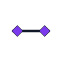

Parameters:

- color: #7C3AED
- connector_kind: bridge
- node_shape: diamond
- variant: 0

### fig-213 - Connector bridge diamond v2

Parameters:

- color: #0F766E
- connector_kind: bridge
- node_shape: diamond
- variant: 1

### fig-214 - Connector bridge diamond v3

Parameters:

- color: #111827
- connector_kind: bridge
- node_shape: diamond
- variant: 2

### fig-215 - Connector bridge diamond v4

Parameters:

- color: #DC2626
- connector_kind: bridge
- node_shape: diamond
- variant: 3

### fig-216 - Connector bridge triangle v1

Parameters:

- color: #111827
- connector_kind: bridge
- node_shape: triangle
- variant: 0

### fig-217 - Connector bridge triangle v2

Parameters:

- color: #DC2626
- connector_kind: bridge
- node_shape: triangle
- variant: 1

### fig-218 - Connector bridge triangle v3

Parameters:

- color: #7C3AED
- connector_kind: bridge
- node_shape: triangle
- variant: 2

### fig-219 - Connector bridge triangle v4

Parameters:

- color: #0F766E
- connector_kind: bridge
- node_shape: triangle
- variant: 3

### fig-220 - Connector bridge hexagon v1

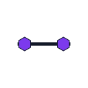

Parameters:

- color: #7C3AED
- connector_kind: bridge
- node_shape: hexagon
- variant: 0

### fig-221 - Connector bridge hexagon v2

Parameters:

- color: #0F766E
- connector_kind: bridge
- node_shape: hexagon
- variant: 1

### fig-222 - Connector bridge hexagon v3

Parameters:

- color: #111827
- connector_kind: bridge
- node_shape: hexagon
- variant: 2

### fig-223 - Connector bridge hexagon v4

Parameters:

- color: #DC2626
- connector_kind: bridge
- node_shape: hexagon
- variant: 3

### fig-224 - Connector triangle circle v1

Parameters:

- color: #111827
- connector_kind: triangle
- node_shape: circle
- variant: 0

### fig-225 - Connector triangle circle v2

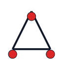

Parameters:

- color: #DC2626
- connector_kind: triangle
- node_shape: circle
- variant: 1

### fig-226 - Connector triangle circle v3

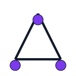

Parameters:

- color: #7C3AED
- connector_kind: triangle
- node_shape: circle
- variant: 2

### fig-227 - Connector triangle circle v4

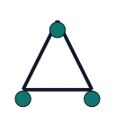

Parameters:

- color: #0F766E
- connector_kind: triangle
- node_shape: circle
- variant: 3

### fig-228 - Connector triangle square v1

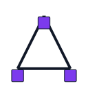

Parameters:

- color: #7C3AED
- connector_kind: triangle
- node_shape: square
- variant: 0

### fig-229 - Connector triangle square v2

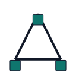

Parameters:

- color: #0F766E
- connector_kind: triangle
- node_shape: square
- variant: 1

### fig-230 - Connector triangle square v3

Parameters:

- color: #111827
- connector_kind: triangle
- node_shape: square
- variant: 2

### fig-231 - Connector triangle square v4

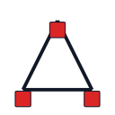

Parameters:

- color: #DC2626
- connector_kind: triangle
- node_shape: square
- variant: 3

### fig-232 - Connector triangle diamond v1

Parameters:

- color: #111827
- connector_kind: triangle
- node_shape: diamond
- variant: 0

### fig-233 - Connector triangle diamond v2

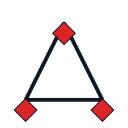

Parameters:

- color: #DC2626
- connector_kind: triangle
- node_shape: diamond
- variant: 1

### fig-234 - Connector triangle diamond v3

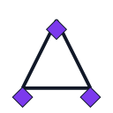

Parameters:

- color: #7C3AED
- connector_kind: triangle
- node_shape: diamond
- variant: 2

### fig-235 - Connector triangle diamond v4

Parameters:

- color: #0F766E
- connector_kind: triangle
- node_shape: diamond
- variant: 3

### fig-236 - Connector triangle triangle v1

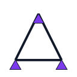

Parameters:

- color: #7C3AED
- connector_kind: triangle
- node_shape: triangle
- variant: 0

### fig-237 - Connector triangle triangle v2

Parameters:

- color: #0F766E
- connector_kind: triangle
- node_shape: triangle
- variant: 1

### fig-238 - Connector triangle triangle v3

Parameters:

- color: #111827
- connector_kind: triangle
- node_shape: triangle
- variant: 2

### fig-239 - Connector triangle triangle v4

Parameters:

- color: #DC2626
- connector_kind: triangle
- node_shape: triangle
- variant: 3

### fig-240 - Connector triangle hexagon v1

Parameters:

- color: #111827
- connector_kind: triangle
- node_shape: hexagon
- variant: 0

### fig-241 - Connector triangle hexagon v2

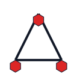

Parameters:

- color: #DC2626
- connector_kind: triangle
- node_shape: hexagon
- variant: 1

### fig-242 - Connector triangle hexagon v3

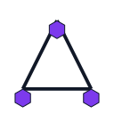

Parameters:

- color: #7C3AED
- connector_kind: triangle
- node_shape: hexagon
- variant: 2

### fig-243 - Connector triangle hexagon v4

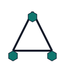

Parameters:

- color: #0F766E
- connector_kind: triangle
- node_shape: hexagon
- variant: 3

### fig-244 - Connector ladder circle v1

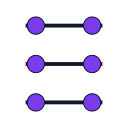

Parameters:

- color: #7C3AED
- connector_kind: ladder
- node_shape: circle
- variant: 0

### fig-245 - Connector ladder circle v2

Parameters:

- color: #0F766E
- connector_kind: ladder
- node_shape: circle
- variant: 1

### fig-246 - Connector ladder circle v3

Parameters:

- color: #111827
- connector_kind: ladder
- node_shape: circle
- variant: 2

### fig-247 - Connector ladder circle v4

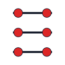

Parameters:

- color: #DC2626
- connector_kind: ladder
- node_shape: circle
- variant: 3

### fig-248 - Connector ladder square v1

Parameters:

- color: #111827
- connector_kind: ladder
- node_shape: square
- variant: 0

### fig-249 - Connector ladder square v2

Parameters:

- color: #DC2626
- connector_kind: ladder
- node_shape: square
- variant: 1

### fig-250 - Connector ladder square v3

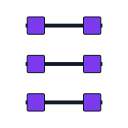

Parameters:

- color: #7C3AED
- connector_kind: ladder
- node_shape: square
- variant: 2

### fig-251 - Connector ladder square v4

Parameters:

- color: #0F766E
- connector_kind: ladder
- node_shape: square
- variant: 3

### fig-252 - Connector ladder diamond v1

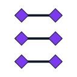

Parameters:

- color: #7C3AED
- connector_kind: ladder
- node_shape: diamond
- variant: 0

### fig-253 - Connector ladder diamond v2

Parameters:

- color: #0F766E
- connector_kind: ladder
- node_shape: diamond
- variant: 1

### fig-254 - Connector ladder diamond v3

Parameters:

- color: #111827
- connector_kind: ladder
- node_shape: diamond
- variant: 2

### fig-255 - Connector ladder diamond v4

Parameters:

- color: #DC2626
- connector_kind: ladder
- node_shape: diamond
- variant: 3

### fig-256 - Connector ladder triangle v1

Parameters:

- color: #111827
- connector_kind: ladder
- node_shape: triangle
- variant: 0

### fig-257 - Connector ladder triangle v2

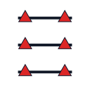

Parameters:

- color: #DC2626
- connector_kind: ladder
- node_shape: triangle
- variant: 1

### fig-258 - Connector ladder triangle v3

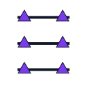

Parameters:

- color: #7C3AED
- connector_kind: ladder
- node_shape: triangle
- variant: 2

### fig-259 - Connector ladder triangle v4

Parameters:

- color: #0F766E
- connector_kind: ladder
- node_shape: triangle
- variant: 3

### fig-260 - Connector ladder hexagon v1

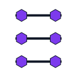

Parameters:

- color: #7C3AED
- connector_kind: ladder
- node_shape: hexagon
- variant: 0

### fig-261 - Connector ladder hexagon v2

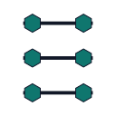

Parameters:

- color: #0F766E
- connector_kind: ladder
- node_shape: hexagon
- variant: 1

### fig-262 - Connector ladder hexagon v3

Parameters:

- color: #111827
- connector_kind: ladder
- node_shape: hexagon
- variant: 2

### fig-263 - Connector ladder hexagon v4

Parameters:

- color: #DC2626
- connector_kind: ladder
- node_shape: hexagon
- variant: 3

## Radial Structure

Count: 60

### fig-264 - Radial circle spokes5 v1

Parameters:

- color: #111827
- shape: circle
- spokes: 5
- variant: 0

### fig-265 - Radial circle spokes5 v2

Parameters:

- color: #DC2626
- shape: circle
- spokes: 5
- variant: 1

### fig-266 - Radial triangle spokes5 v1

Parameters:

- color: #DC2626
- shape: triangle
- spokes: 5
- variant: 0

### fig-267 - Radial triangle spokes5 v2

Parameters:

- color: #7C3AED
- shape: triangle
- spokes: 5
- variant: 1

### fig-268 - Radial diamond spokes5 v1

Parameters:

- color: #7C3AED
- shape: diamond
- spokes: 5
- variant: 0

### fig-269 - Radial diamond spokes5 v2

Parameters:

- color: #0F766E
- shape: diamond
- spokes: 5
- variant: 1

### fig-270 - Radial square spokes5 v1

Parameters:

- color: #0F766E
- shape: square
- spokes: 5
- variant: 0

### fig-271 - Radial square spokes5 v2

Parameters:

- color: #111827
- shape: square
- spokes: 5
- variant: 1

### fig-272 - Radial pentagon spokes5 v1

Parameters:

- color: #111827
- shape: pentagon
- spokes: 5
- variant: 0

### fig-273 - Radial pentagon spokes5 v2

Parameters:

- color: #DC2626
- shape: pentagon
- spokes: 5
- variant: 1

### fig-274 - Radial circle spokes6 v1

Parameters:

- color: #DC2626
- shape: circle
- spokes: 6
- variant: 0

### fig-275 - Radial circle spokes6 v2

Parameters:

- color: #7C3AED
- shape: circle
- spokes: 6
- variant: 1

### fig-276 - Radial triangle spokes6 v1

Parameters:

- color: #7C3AED
- shape: triangle
- spokes: 6
- variant: 0

### fig-277 - Radial triangle spokes6 v2

Parameters:

- color: #0F766E
- shape: triangle
- spokes: 6
- variant: 1

### fig-278 - Radial diamond spokes6 v1

Parameters:

- color: #0F766E
- shape: diamond
- spokes: 6
- variant: 0

### fig-279 - Radial diamond spokes6 v2

Parameters:

- color: #111827
- shape: diamond
- spokes: 6
- variant: 1

### fig-280 - Radial square spokes6 v1

Parameters:

- color: #111827
- shape: square
- spokes: 6
- variant: 0

### fig-281 - Radial square spokes6 v2

Parameters:

- color: #DC2626
- shape: square
- spokes: 6
- variant: 1

### fig-282 - Radial pentagon spokes6 v1

Parameters:

- color: #DC2626
- shape: pentagon
- spokes: 6
- variant: 0

### fig-283 - Radial pentagon spokes6 v2

Parameters:

- color: #7C3AED
- shape: pentagon
- spokes: 6
- variant: 1

### fig-284 - Radial circle spokes7 v1

Parameters:

- color: #7C3AED
- shape: circle
- spokes: 7
- variant: 0

### fig-285 - Radial circle spokes7 v2

Parameters:

- color: #0F766E
- shape: circle
- spokes: 7
- variant: 1

### fig-286 - Radial triangle spokes7 v1

Parameters:

- color: #0F766E
- shape: triangle
- spokes: 7
- variant: 0

### fig-287 - Radial triangle spokes7 v2

Parameters:

- color: #111827
- shape: triangle
- spokes: 7
- variant: 1

### fig-288 - Radial diamond spokes7 v1

Parameters:

- color: #111827
- shape: diamond
- spokes: 7
- variant: 0

### fig-289 - Radial diamond spokes7 v2

Parameters:

- color: #DC2626
- shape: diamond
- spokes: 7
- variant: 1

### fig-290 - Radial square spokes7 v1

Parameters:

- color: #DC2626
- shape: square
- spokes: 7
- variant: 0

### fig-291 - Radial square spokes7 v2

Parameters:

- color: #7C3AED
- shape: square
- spokes: 7
- variant: 1

### fig-292 - Radial pentagon spokes7 v1

Parameters:

- color: #7C3AED
- shape: pentagon
- spokes: 7
- variant: 0

### fig-293 - Radial pentagon spokes7 v2

Parameters:

- color: #0F766E
- shape: pentagon
- spokes: 7
- variant: 1

### fig-294 - Radial circle spokes8 v1

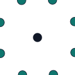

Parameters:

- color: #0F766E
- shape: circle
- spokes: 8
- variant: 0

### fig-295 - Radial circle spokes8 v2

Parameters:

- color: #111827
- shape: circle
- spokes: 8
- variant: 1

### fig-296 - Radial triangle spokes8 v1

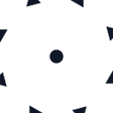

Parameters:

- color: #111827
- shape: triangle
- spokes: 8
- variant: 0

### fig-297 - Radial triangle spokes8 v2

Parameters:

- color: #DC2626
- shape: triangle
- spokes: 8
- variant: 1

### fig-298 - Radial diamond spokes8 v1

Parameters:

- color: #DC2626
- shape: diamond
- spokes: 8
- variant: 0

### fig-299 - Radial diamond spokes8 v2

Parameters:

- color: #7C3AED
- shape: diamond
- spokes: 8
- variant: 1

### fig-300 - Radial square spokes8 v1

Parameters:

- color: #7C3AED
- shape: square
- spokes: 8
- variant: 0

### fig-301 - Radial square spokes8 v2

Parameters:

- color: #0F766E
- shape: square
- spokes: 8
- variant: 1

### fig-302 - Radial pentagon spokes8 v1

Parameters:

- color: #0F766E
- shape: pentagon
- spokes: 8
- variant: 0

### fig-303 - Radial pentagon spokes8 v2

Parameters:

- color: #111827
- shape: pentagon
- spokes: 8
- variant: 1

### fig-304 - Radial circle spokes9 v1

Parameters:

- color: #111827
- shape: circle
- spokes: 9
- variant: 0

### fig-305 - Radial circle spokes9 v2

Parameters:

- color: #DC2626
- shape: circle
- spokes: 9
- variant: 1

### fig-306 - Radial triangle spokes9 v1

Parameters:

- color: #DC2626
- shape: triangle
- spokes: 9
- variant: 0

### fig-307 - Radial triangle spokes9 v2

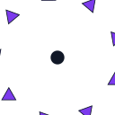

Parameters:

- color: #7C3AED
- shape: triangle
- spokes: 9
- variant: 1

### fig-308 - Radial diamond spokes9 v1

Parameters:

- color: #7C3AED
- shape: diamond
- spokes: 9
- variant: 0

### fig-309 - Radial diamond spokes9 v2

Parameters:

- color: #0F766E
- shape: diamond
- spokes: 9
- variant: 1

### fig-310 - Radial square spokes9 v1

Parameters:

- color: #0F766E
- shape: square
- spokes: 9
- variant: 0

### fig-311 - Radial square spokes9 v2

Parameters:

- color: #111827
- shape: square
- spokes: 9
- variant: 1

### fig-312 - Radial pentagon spokes9 v1

Parameters:

- color: #111827
- shape: pentagon
- spokes: 9
- variant: 0

### fig-313 - Radial pentagon spokes9 v2

Parameters:

- color: #DC2626
- shape: pentagon
- spokes: 9
- variant: 1

### fig-314 - Radial circle spokes10 v1

Parameters:

- color: #DC2626
- shape: circle
- spokes: 10
- variant: 0

### fig-315 - Radial circle spokes10 v2

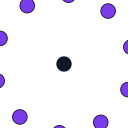

Parameters:

- color: #7C3AED
- shape: circle
- spokes: 10
- variant: 1

### fig-316 - Radial triangle spokes10 v1

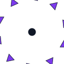

Parameters:

- color: #7C3AED
- shape: triangle
- spokes: 10
- variant: 0

### fig-317 - Radial triangle spokes10 v2

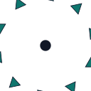

Parameters:

- color: #0F766E
- shape: triangle
- spokes: 10
- variant: 1

### fig-318 - Radial diamond spokes10 v1

Parameters:

- color: #0F766E
- shape: diamond
- spokes: 10
- variant: 0

### fig-319 - Radial diamond spokes10 v2

Parameters:

- color: #111827
- shape: diamond
- spokes: 10
- variant: 1

### fig-320 - Radial square spokes10 v1

Parameters:

- color: #111827
- shape: square
- spokes: 10
- variant: 0

### fig-321 - Radial square spokes10 v2

Parameters:

- color: #DC2626
- shape: square
- spokes: 10
- variant: 1

### fig-322 - Radial pentagon spokes10 v1

Parameters:

- color: #DC2626
- shape: pentagon
- spokes: 10
- variant: 0

### fig-323 - Radial pentagon spokes10 v2

Parameters:

- color: #7C3AED
- shape: pentagon
- spokes: 10
- variant: 1

## Concentric Structure

Count: 30

### fig-324 - Concentric rings3 v1

Parameters:

- accent_color: #111827
- primary_color: #7C3AED
- rings: 3
- variant: 0

### fig-325 - Concentric rings3 v2

Parameters:

- accent_color: #DC2626
- primary_color: #0F766E
- rings: 3
- variant: 1

### fig-326 - Concentric rings3 v3

Parameters:

- accent_color: #7C3AED
- primary_color: #111827
- rings: 3
- variant: 2

### fig-327 - Concentric rings3 v4

Parameters:

- accent_color: #0F766E
- primary_color: #DC2626
- rings: 3
- variant: 3

### fig-328 - Concentric rings3 v5

Parameters:

- accent_color: #111827
- primary_color: #7C3AED
- rings: 3
- variant: 4

### fig-329 - Concentric rings4 v1

Parameters:

- accent_color: #EA580C
- primary_color: #1D4ED8
- rings: 4
- variant: 0

### fig-330 - Concentric rings4 v2

Parameters:

- accent_color: #BE123C
- primary_color: #059669
- rings: 4
- variant: 1

### fig-331 - Concentric rings4 v3

Parameters:

- accent_color: #1D4ED8
- primary_color: #EA580C
- rings: 4
- variant: 2

### fig-332 - Concentric rings4 v4

Parameters:

- accent_color: #059669
- primary_color: #BE123C
- rings: 4
- variant: 3

### fig-333 - Concentric rings4 v5

Parameters:

- accent_color: #EA580C
- primary_color: #1D4ED8
- rings: 4
- variant: 4

### fig-334 - Concentric rings5 v1

Parameters:

- accent_color: #DC2626
- primary_color: #0F766E
- rings: 5
- variant: 0

### fig-335 - Concentric rings5 v2

Parameters:

- accent_color: #7C3AED
- primary_color: #111827
- rings: 5
- variant: 1

### fig-336 - Concentric rings5 v3

Parameters:

- accent_color: #0F766E
- primary_color: #DC2626
- rings: 5
- variant: 2

### fig-337 - Concentric rings5 v4

Parameters:

- accent_color: #111827
- primary_color: #7C3AED
- rings: 5
- variant: 3

### fig-338 - Concentric rings5 v5

Parameters:

- accent_color: #DC2626
- primary_color: #0F766E
- rings: 5
- variant: 4

### fig-339 - Concentric rings6 v1

Parameters:

- accent_color: #BE123C
- primary_color: #059669
- rings: 6
- variant: 0

### fig-340 - Concentric rings6 v2

Parameters:

- accent_color: #1D4ED8
- primary_color: #EA580C
- rings: 6
- variant: 1

### fig-341 - Concentric rings6 v3

Parameters:

- accent_color: #059669
- primary_color: #BE123C
- rings: 6
- variant: 2

### fig-342 - Concentric rings6 v4

Parameters:

- accent_color: #EA580C
- primary_color: #1D4ED8
- rings: 6
- variant: 3

### fig-343 - Concentric rings6 v5

Parameters:

- accent_color: #BE123C
- primary_color: #059669
- rings: 6
- variant: 4

### fig-344 - Concentric rings7 v1

Parameters:

- accent_color: #7C3AED
- primary_color: #111827
- rings: 7
- variant: 0

### fig-345 - Concentric rings7 v2

Parameters:

- accent_color: #0F766E
- primary_color: #DC2626
- rings: 7
- variant: 1

### fig-346 - Concentric rings7 v3

Parameters:

- accent_color: #111827
- primary_color: #7C3AED
- rings: 7
- variant: 2

### fig-347 - Concentric rings7 v4

Parameters:

- accent_color: #DC2626
- primary_color: #0F766E
- rings: 7
- variant: 3

### fig-348 - Concentric rings7 v5

Parameters:

- accent_color: #7C3AED
- primary_color: #111827
- rings: 7
- variant: 4

### fig-349 - Concentric rings8 v1

Parameters:

- accent_color: #1D4ED8
- primary_color: #EA580C
- rings: 8
- variant: 0

### fig-350 - Concentric rings8 v2

Parameters:

- accent_color: #059669
- primary_color: #BE123C
- rings: 8
- variant: 1

### fig-351 - Concentric rings8 v3

Parameters:

- accent_color: #EA580C
- primary_color: #1D4ED8
- rings: 8
- variant: 2

### fig-352 - Concentric rings8 v4

Parameters:

- accent_color: #BE123C
- primary_color: #059669
- rings: 8
- variant: 3

### fig-353 - Concentric rings8 v5

Parameters:

- accent_color: #1D4ED8
- primary_color: #EA580C
- rings: 8
- variant: 4
